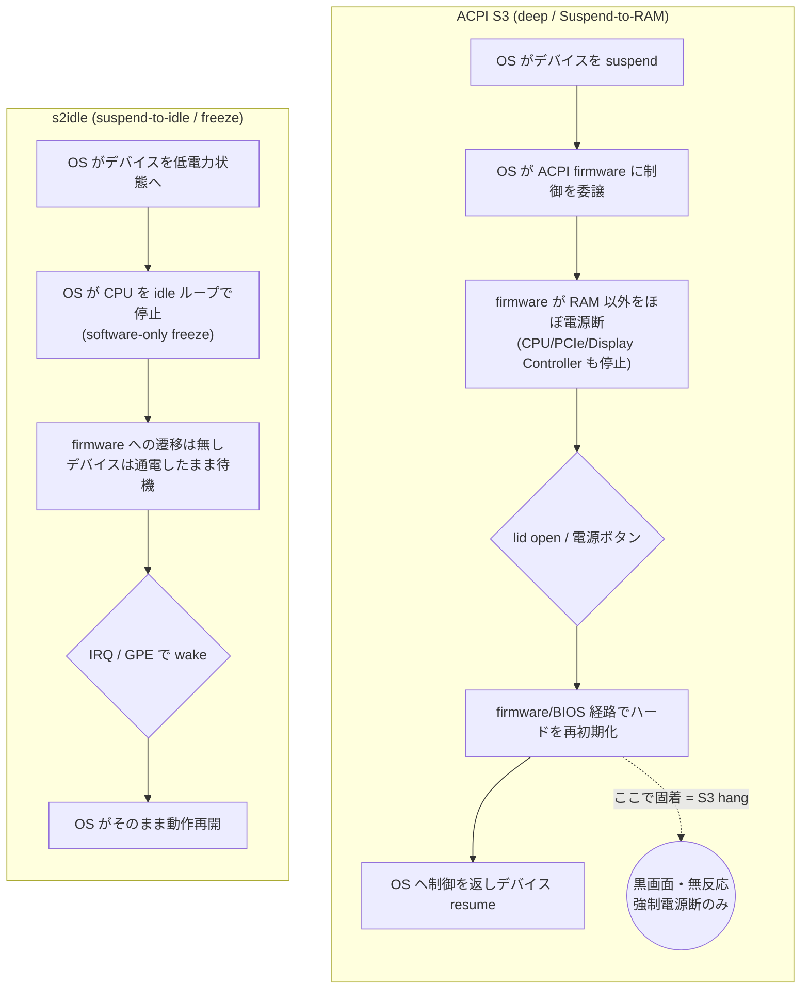

# なぜ ACPI S3 (deep sleep) を使っていないのか — 経緯と根拠の通読版

- **作成日時**: 2026年06月18日 14:23 (JST)
- **対象ホスト**: `macbookair2015.lan` (MacBook Air 11" Early 2015 / MacBookAir7,1)
- **種別**: 既存レポート群の統合・解説（新規の実機操作・設定変更は行っていない）

## 0. 要約 (TL;DR)

本機のスリープは現在、**ACPI S3 (deep sleep) ではなく s2idle** で恒久運用している。理由は
次の 3 点に集約される。

1. **S3 deep の復帰経路でカーネルが固まる "S3 hang" が、週 0.7〜0.8 件のペースで再発し続けた。**
   蓋を開けても画面が真っ暗のまま、電源ボタンにも反応せず、強制電源断でしか脱出できない。
2. **その原因を特定する手段が原理的に存在しない。** hang はログに痕跡を残さず（最終行は常に
   `PM: suspend entry (deep)`）、強制電源断でカーネルのリングバッファごと消える。pstore も
   netconsole も効かない。3 種類のカーネルパラメータ対策を順に試したが、いずれも長くても 2 週間
   以内に再発し（最短 35 時間）、「効いたのか偶然か」すら判定できなかった。
3. **唯一フィードバックを得られる手段が「故障経路そのものを使わないこと」だった。** S3 hang は
   ACPI S3 deep の firmware 遷移に紐づく。s2idle はその遷移を行わない。そこで 2026-05-31 に
   スリープモードを s2idle へ恒久切替し、hang の症状そのものを断った。

s2idle には代償（lid open で起きない・待機電力・キーボードバックライト点灯）があるが、いずれも
対処済みか許容済みで、「復帰 hang に悩まされ続ける S3」より明確に良い、というのが現在の結論である。

---

## 1. 前提・環境情報

| 項目 | 値 |
|---|---|
| 機種 | Apple MacBook Air 11" Early 2015 (MacBookAir7,1, Broadwell-U) |
| OS | Debian 13 (trixie) |
| カーネル | `6.12.x+deb13-amd64`（観測期間で 6.12.74〜6.12.90 の複数版にまたがり再発） |
| GPU / 内蔵パネル | Intel HD Graphics 6000 / 内蔵 eDP-1（**PSR 非対応** = `i915.enable_psr=0` は無効） |
| 入力 | USB トラックパッド/キーボード（`bcm5974`）。`applespi` は本機未使用だが auto-load される |
| Wi-Fi | Broadcom BCM4360（`broadcom-sta-dkms` / `wl`） |
| 操作経路 | すべて ssh 越し（`miminashi@macbookair2015.lan`、NOPASSWD sudo） |

> 内蔵パネルが PSR 非対応である点は重要で、ネットでよく挙がる定番対策 `i915.enable_psr=0` は
> 本機ではそもそも PSR が active でないため効果がなく、検討の初期に候補から外している。

---

## 2. 症状: "S3 hang" とは何か

通常運用中、**ときどき lid (蓋) を開けても S3 から復帰しない**事象が発生していた。

- 画面は真っ暗のまま。**電源ボタンを押しても反応しない**（＝カーネルが完全に固まっている）。
- 脱出方法は**電源ボタン長押しによる強制電源断 → 再起動**のみ。
- 発生はランダムで、頻度は **約 0.7〜0.8 件/週**（2026-04-01〜05-22 の約 7.5 週間で 6 件）。

ログ上のシグネチャは一貫していた。journal の末尾が

```
systemd-sleep[...]: Performing sleep operation 'suspend'...
kernel: PM: suspend entry (deep)
```

で**完全に途切れ**、以降カーネル・ユーザランドとも一切のログがなく、次の boot（強制再起動後）に
飛ぶ。これは「S3 (deep) 経路でカーネルが固まり、強制電源断でしか脱出できなかった」事象と完全に
一致する。

なお hang の直前には必ず `gnome-shell: Cursor update failed: drmModeAtomicCommit`（i915 の DRM
警告）が出ていたが、これは**正常 suspend の直前にも約 65% の頻度で出ており、失敗の特異マーカー
ではない**（後に red herring と確定）。i915 周辺の不安定さを示唆するだけのノイズである。

---

## 3.【図1】S3 deep と s2idle の機構差 — なぜ S3 *だけ* が固まるのか

S3 hang の核心は、**S3 と s2idle で「誰が」「どこまで」システムを眠らせるかが根本的に違う**こと
にある。



要点:

- **S3 deep** は、OS が制御を **ACPI firmware (Apple の EFI/BIOS)** に渡し、RAM 以外をほぼ電源断
  する。復帰時は firmware 経路でハードを再初期化してから OS に戻る。**この firmware 往復のどこか
  でカーネルが固着する**のが S3 hang である。Broadwell + i915 の Display Controller (DC5/DC6) 起因
  の S3 復帰固着は Intel/freedesktop のバグトラッカー等にも複数報告のある既知パターンで、本機の
  シグネチャ（DRM 警告直後の S3 固着）とも整合する。
- **s2idle** は firmware に制御を渡さない。CPU を idle ループに落とすだけの **software-only freeze**
  で、デバイスは低電力ながら通電したまま。**固着しうる firmware 遷移そのものが存在しない**。

→ つまり「S3 hang を直す」最も確実な方法は、**S3 の firmware 遷移を使わないこと**＝ s2idle への
切替である。これが最終的に採った手段の機構的根拠になっている。

---

## 4. なぜ原因を「特定」できなかったのか — 診断ループのフィードバックがゼロ

S3 を粘らずに捨てた最大の理由は、**この故障の原因を絞り込む観測手段が原理的に存在しなかった**点
にある。

### 4.1 hang 箇所がログから見えない

最終行が常に `PM: suspend entry (deep)` で止まるが、これは**「suspend 経路で固まった」のか
「resume 経路で固まった」のか区別できない**ことを意味する。suspend/resume 中のカーネルログは
disk に flush されないため、どちらのケースでも「最後に残る行 = suspend entry」になってしまう。
実際、ある boot では一度正常復帰（`PM: suspend exit` を記録）した後、次の再 suspend で hang して
おり、ログだけでは入口の失敗か出口の失敗か判別不能だった。

### 4.2 強制電源断を跨いでログを残す手段がない

```
   suspend 中のカーネルログ ──▶ RAM 上のリングバッファに溜まる
                                      │
                  resume 成功時 ──────┼──▶ journal に flush (残る)
                                      │
              強制電源断 (cold off) ──┴──▶ RAM 消失でリングバッファごと喪失 (残らない)
```

- **pstore / ERST が無い**: `/sys/fs/pstore` は空で、強制電源断を跨いで dmesg を残せない
  （`efi-pstore` はあるが、静かなフリーズ時に EFI runtime services を呼べないため本症状の debug には
  使えないことを確認済み）。
- **netconsole も無力**: 早期 suspend/resume の hang ではネットワークデバイスが既に suspend 済みで
  ログが飛ばない。
- **`no_console_suspend` も無力**: console 出力もリングバッファ経由なので、結局 cold off で消える。

→ **再発しても何ひとつ新しい情報が得られない。** これは「1 パラメータを盲目的に当てて数週間待つ」
という診断ループが**フィードバックを返さない**ことを意味し、後述の 3 連敗の根因でもある。

---

## 5. S3 を維持したまま試した 3 段の対策 — すべて失敗

「S3 deep を保ったまま直す」方針で、副作用の小さい順に 1 変数ずつ適用 → 数週間観測、を 3 回
繰り返した。結果はいずれも再発である。

```
2026-05-10  対策1: i915.enable_dc=0 を適用
              │  (Broadwell+i915 の DC ステート起因という理論ベース。効果は未検証)
              ▼  9 日後
2026-05-19  ✗ 再発 (boot 77cd5397)。しかも一段早い "device suspend phase" で停止
              │  → PM: suspend entry すら出ない変種
              ▼
2026-05-22  対策2: applespi を blacklist + no_console_suspend 追加
              │  (本機未使用だが auto-load されるドライバの suspend フック固着を疑う)
              ▼  約 35 時間後
2026-05-23  ✗ 再発、しかも 1 日 2 回 (6 cycle 中 2 hang ≒ 33%)
              │
2026-05-23  対策3: pcie_aspm=off を追加 + pm_print_times=1 永続化
              │  (PCIe ASPM 起因を疑う最後の手段。待機電力増の副作用あり)
              ▼  約 7 日後
2026-05-30  ✗ 再発 (boot 33c46652)。約 12h のギャップ後に強制起動
              │
              ▼
2026-05-31  → 「S3 を直す」方針を断念し、s2idle へ恒久切替 (§6)
```

各対策の評価:

| 対策 | 適用日 | 再発まで | 統計的評価 |
|---|---|---|---|
| `i915.enable_dc=0` | 05-10 | 9 日（05-19） | 1 件。元の 0.7〜0.8 件/週と区別不能 |
| `applespi` blacklist | 05-22 | 約 35h（05-23） | 対策直後にむしろ頻度悪化（サンプル小） |
| `pcie_aspm=off` | 05-23 | 約 7 日（05-30） | 効果なし。待機電力だけ増えた |

**3 連敗から確定したこと**: §4 のとおり hang は観測手段を与えないため、「当てずっぽうの 1 パラメータ
試行 → 観測」をいくら続けても、再発しても効果の有無すら判定できない。`i915.enable_dc=0` に至っては、
切り分け実験の段階で**ベースライン (無対策) でも 30 cycle 連続成功**してしまい、そもそもラピッド
ファイア試験が reproducer になっていなかった（＝対策の効果を測る土俵が無かった）。

---

## 6. 方針転換: なぜ S3 を「やめた」のか

3 連敗で「S3 を保ったまま原因を潰す」道が**フィードバックを返さない袋小路**だと確定した。そこで
2026-05-31、方針を転換した。

> **hang が紐づく ACPI S3 deep の firmware 遷移そのものを使わない。**

§3 のとおり、S3 hang は firmware 往復の固着であり、s2idle はその遷移を行わない。原因を特定できなく
ても、**故障経路を経由しなければ症状は出ない**。これは「原因究明」ではなく「症状の根絶」だが、
観測手段がゼロである以上、**実際に状態が改善したか否かをユーザが体感で確認できる唯一の打ち手**
でもあった。

具体的な変更（実機 `macbookair2015.lan`）:

```diff
- GRUB_CMDLINE_LINUX_DEFAULT="quiet i915.enable_dc=0 no_console_suspend pcie_aspm=off"
+ GRUB_CMDLINE_LINUX_DEFAULT="quiet no_console_suspend mem_sleep_default=s2idle"
```

`mem_sleep_default=s2idle` で boot 時に `/sys/power/mem_sleep` を `[s2idle] deep` にすると、systemd が
`/sys/power/state` に `mem` を書いても自動的に s2idle が選ばれる。失敗対策だった `i915.enable_dc=0` /
`pcie_aspm=off` は、効果が無かった上に**どちらも s2idle の待機電力を増やす**ため除去した。

---

## 7. s2idle のトレードオフと、それでも採った理由

ここで率直に書いておかねばならないことがある。**s2idle は、2026-05-10 の時点では「常用不可」として
一度却下していた選択肢**である。却下理由は「lid open で起きない」「キーボードバックライトが点灯
し続ける」「S3 より待機電力が増える」の 3 点だった。

それでも 2026-05-31 に採用へ反転したのは、**S3 hang が解決不能と判明し、「復帰 hang を断つ」便益が
これらトレードオフを上回ると再評価した**からである。却下理由が消えたのではなく、各々に対処策を
講じた上で「S3 を続けるより良い」と判断した。以下、3 つの代償それぞれの顛末を示す。

### 7.1 待機電力 — 「S3 より増える」→ 抑止下では 0.70W で許容

s2idle は浅いスリープのため、enabled な wakeup ソース **XHC1 (USB) / RP01-06 (PCIe, Wi-Fi)** が
ネットワーク/USB トラフィックで**約 84 秒ごとに実機を起こす**ことが判明した。これを放置すると
wake-cycling や「蓋を閉じたまま覚醒 (awake ≈ 6.3W)」となり実用にならない（＝ 05-10 の「電力増」
懸念はこの状態を指していた）。

そこで udev ルールで該当デバイスの `power/wakeup` を boot 時に `disabled` へ永続化し、**wake 源を
LID0（と電源ボタン）だけに絞った**クリーンな構成にした（この時点では「LID0 を残せば lid open で
復帰できる」と見込んでいた。実際には lid wake が届かないことが後に判明する — §7.2）。

```
# /etc/udev/rules.d/90-s2idle-wakeup-suppress.rules
SUBSYSTEM=="pci", KERNEL=="0000:00:14.0", ATTR{power/wakeup}="disabled"  # XHC1 (USB)
SUBSYSTEM=="pci", KERNEL=="0000:00:1c.[01245]", ATTR{power/wakeup}="disabled"  # RP01-06 (PCIe)
```

抑止後の実測（20 分・バッテリ駆動）は **平均 0.70W**。12h 夜間で 22%、満充電から約 55 時間もつ計算で、
**実用上完全に許容範囲**である。つまり「S3 より電力が増える」という 05-10 の評価と「0.70W で許容」と
いう 05-31 の評価は、**spurious wakeup を抑止する前と後という別条件の数値**であり、両立する。

### 7.2 lid open で起きない — 当初の期待は外れ、構造的に不可能と確定

これが最も評価が揺れた点で、認識は三段階で変遷した。

1. **2026-05-10（却下時）**: 「s2idle は lid open で起きない、キー押下が必要」と観測。
2. **2026-05-31（採用時）**: udev 抑止後に `/proc/acpi/wakeup` の enabled が `LID0` のみになったため、
   「LID0 で lid 復帰する**見込み**」と期待した。
3. **2026-06-18（確定）**: 制御実験（蓋を閉じ→ s2idle 投入→物理的に蓋を開ける、を 3 回）で
   **0/3**。s2idle では lid open で起きないことが**構造的に確定**した。機構は二重の壁による:
   - lid 通知は EC の runtime GPE (gpe4E, アイドルで約 145 回/秒) に相乗りしており、s2idle 進入時に
     カーネルが wake-GPE 以外を無効化するため**届かない**。
   - DSDT 上 `LID0` が宣言する wake GPE = `0x70 (gpe70)` は、全試行を通じてカウント 0
     ＝**実機で配線されておらず、lid open のハード wake 信号として発火しない**。

結果として **05-10 の観測（起きない）が正しく、05-31 の期待（起きる見込み）が誤りだった**。
ただし運用上の救済はある: **電源ボタンの短押しは s2idle を IRQ 経由で確実に起こせる**ことを別途
実証済み（有効押下 3/3 が早期復帰）。よって現運用は「**蓋開けで起きなければ電源ボタンを短く押す**」
で確定している（100% の lid 復帰は諦め、たまの電源ボタン押下は許容、というユーザ判断）。

### 7.3 キーボードバックライトが点灯し続ける — sleep フックで消灯

s2idle は software freeze なので LED も通電したままになる（05-10 の却下理由のひとつ）。これは
`/usr/lib/systemd/system-sleep/50-kbd-backlight` フックで、suspend 時に輝度を退避して 0 に、復帰時に
復元することで解決した（`systemctl suspend` 実経路で発火・物理目視で消灯を確認済み）。

---

## 8. では s2idle なら hang は出ないのか — 誠実な補足

s2idle 切替は「症状の根絶」を狙ったものであって、「魔法の解決」ではない。実際、**切替後も hang 様の
事象を観測している**。この事実をどう解釈すべきかを正直に書いておく。

切替後の切り分け結果:

- **RTC ストレステスト 68/68 clean**（短時間 90s×60 + 長時間 1800s×6 ほか、hang 0）。
  → wake 源に依存しない s2idle の suspend/resume コード経路は、短時間・長時間とも**完全に動作**する。
- **lid 制御実験 0/3**（§7.2）。s2idle では lid wake が構造的に届かない。
- **電源ボタン短押し 3/3** で復帰（カーネルは生存していた）。

これらを総合すると、s2idle 後に観測された「寝てから起きない」事象の主因は、**真の resume hang では
なく lid-wake の配送失敗**（カーネルは生きており、電源ボタンで復帰できる状態）である可能性が高い。
RTC が 68/68 clean なこととも整合する。

ただし — **真の resume hang を完全には否定していない**。RTC テストは全て lid OPEN で実施しており、
実故障時の「lid CLOSE → OPEN 遷移（ディスプレイ HPD / GPU resume 経路）」を一度も再現できていない。
よって「lid 固有の resume hang」が残存する可能性はゼロではない。次に lid 復帰失敗が起きた際は、
**強制電源断の前に電源ボタンを短押しし、復帰すれば wake 配送失敗（カーネル生存）、無反応なら真の
resume hang**、と切り分ける手順を用意している。

含意として重要なのは、**S3 時代の「寝てから起きない」報告の一部も、実は真の hang ではなく wake 配送
失敗だった可能性がある**こと。ただし S3 hang には `PM: suspend entry (deep)` で完全停止し電源ボタン
にも無反応な件が確実に含まれており（＝ firmware 固着）、s2idle の wake 配送失敗とは別物である。
S3 を避ける根拠（§3〜§6）はこの補足によって揺らがない。

---

## 9. 結論 — S3 を使わない理由

現状、本機のスリープは **s2idle で恒久運用**している。S3 (deep) を使わない理由は、次の 3 点に
集約される。

1. **(a) firmware 遷移経路に起因する復帰 hang** — S3 deep の firmware 往復でカーネルが固着し、
   週 0.7〜0.8 件のペースで「蓋を開けても起きない・電源ボタン無反応・強制電源断のみ」が再発した。
2. **(b) その原因を特定する手段が原理的に無い** — hang はログに痕跡を残さず、pstore も netconsole も
   効かず、suspend 失敗か resume 失敗かすら判別できない。3 種のパラメータ対策は再発のたびに「効果
   不明」のまま終わった。
3. **(c) 経路ごと回避するのが唯一フィードバックを得られる手段だった** — s2idle は固着しうる firmware
   遷移を持たない。原因を究明できなくても、故障経路を通らなければ症状は出ない。

s2idle の代償（lid 非復帰・待機電力・KB バックライト）はそれぞれ対処済み・許容済みであり、「復帰
hang に悩まされ続ける S3」より明確に良い、というのが最終判断である。

---

## 10. 参照レポート（時系列）

| 日付 | レポート | 本書での役割 |
|---|---|---|
| 2026-05-10 | [lid open 復帰失敗 (S3 hang) 切り分けと暫定対策](2026-05-10_055032_lid_open_resume_hang.md) | 症状の初出・シグネチャ確定・s2idle の初回却下 |
| 2026-05-22 | [S3 hang 再発と applespi blacklist 適用](2026-05-22_022030_s3_hang_recurrence_applespi_blacklist.md) | 対策2・早期 hang 変種・検出スクリプト v2 |
| 2026-05-23 | [S3 hang 再発 (1日2回) と pcie_aspm=off 追加](2026-05-23_144518_s3_hang_pcie_aspm_off.md) | 対策3・診断不能の構造の確定 |
| 2026-05-31 | [S3 hang 対策をスリープモード s2idle 恒久切替へ転換](2026-05-31_132125_s3_hang_switch_to_s2idle.md) | **方針転換の中核**・電力実測・udev 抑止 |
| 2026-06-01 | [s2idle でも resume hang 再発 → RTC ストレステストで切り分け](2026-06-01_034724_s2idle_hang_rtcwake_discrimination.md) | 切替後 hang 再発・RTC 68/68 clean |
| 2026-06-03 | [電源ボタン短押しが健全 s2idle を起こす wake 源と実証](2026-06-03_123439_pwrbtn_wake_premise_verification.md) | 電源ボタン復帰 3/3 |
| 2026-06-18 | [キーボードバックライト消灯フック導入 + s2idle lid wake 可否の精査](2026-06-18_135551_kbd_backlight_off_and_lid_wake_probe.md) | lid wake 構造的不可能の確定・KB フック |
